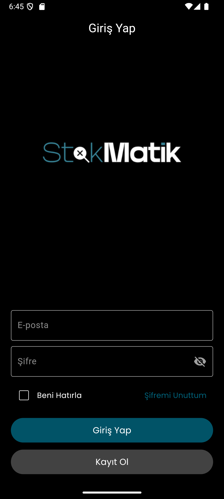
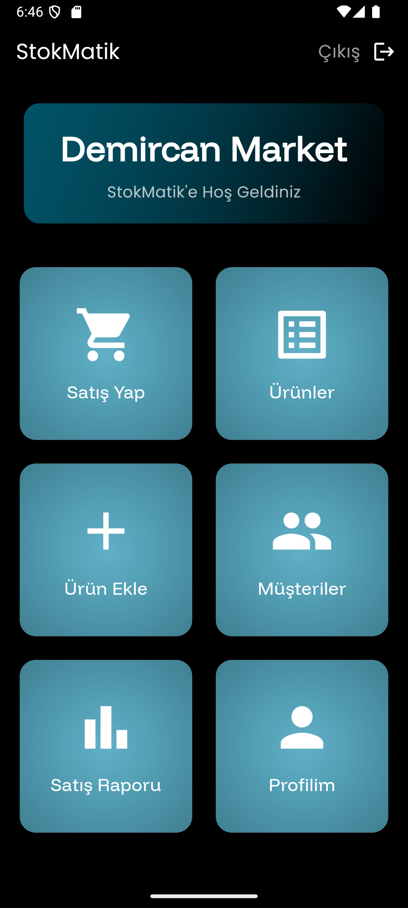
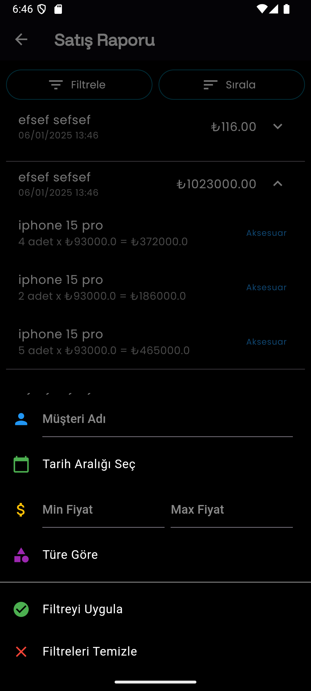

# 📦 StokMatik

**StokMatik** is a modern and simple stock management app built using **Flutter** and powered by **Firebase Firestore**. It is designed for small to medium businesses to efficiently manage their inventory, customers, and sales with ease.

## 🚀 Features

- 🔐 **User Authentication** (Firebase Auth)
- 👤 **Customer Management** (Add / Edit / Delete)
- 📦 **Product Management** (Add / Edit / Delete)
- 💰 **Sales Tracking** (with or without customer)
- 📊 **Sales Reports** (by date or by product)
- 🧾 **User Profile Info**
- 🔄 Real-time Firestore updates
- 🧩 Multi-user support: data is isolated per user (store/market)

## 🛠️ Built With

- Flutter (Dart)
- Firebase Authentication
- Cloud Firestore
- Android Studio

## 📁 Firebase Structure

The project uses a Firestore schema designed to support **multi-user environments**. Each authenticated user has their own isolated subcollections under the `users` collection. This ensures data separation — for example, Store A and Store B have their own set of customers, products, and sales history.

```
users (collection)
│
├── [user_id] (document)
│   ├── companyName
│   ├── companyType
│   ├── createdAt
│   ├── email
│   ├── emailVerified
│   ├── name
│   ├── surname
│   ├── tc
│   │
│   ├── customers (subcollection)
│   │   ├── name
│   │   ├── surname
│   │   ├── iletisim
│   │
│   ├── urunler (subcollection)
│   │   ├── urunadi
│   │   ├── barkod
│   │   ├── fiyat
│   │   ├── stok
│   │   ├── tur
│   │
│   └── satisRaporu (subcollection)
│       ├── urunAdi
│       ├── birimfiyat
│       ├── miktar
│       ├── toplamfiyat
│       ├── musteriAd
│       ├── musteriSoyad
│       ├── tarih
│       ├── tur
```

> 🧠 **Why this structure?**\
> This hierarchical model ensures that each store or market using the app has its own data sandbox, completely separated from other users. That means one market's customers, products, and reports won’t interfere with another’s.

## ⚙️ Getting Started

To run this project locally:

1. **Clone the repository:**

   ```bash
   git clone https://github.com/sadkxx/StokMatik-Flutter-Project.git
   cd "StokMatik-Flutter-Project"
   ```

2. **Install dependencies:**

   ```bash
   flutter pub get
   ```

3. **Firebase Setup:**

   Firebase configuration files are excluded from this repo for security reasons (`.gitignore`). To run the project:

   - Go to [Firebase Console](https://console.firebase.google.com/)
   - Create a project or use an existing one
   - Add an Android and/or iOS app to the Firebase project
   - Download the `google-services.json` (for Android) or `GoogleService-Info.plist` (for iOS)
   - Place the file:
     - `google-services.json` ➡️ `android/app/`
     - `GoogleService-Info.plist` ➡️ `ios/Runner/`

4. **Enable the following Firebase services:**

   - Authentication (Email/Password)
   - Firestore Database

5. **Run the app:**

   ```bash
   flutter run
   ```

## 🖼️ Screenshots

```markdown



```

## 📄 License

This project is licensed under the MIT License - see the [LICENSE](LICENSE) file for details.

---

> Made with ❤️ using Flutter + Firebase

